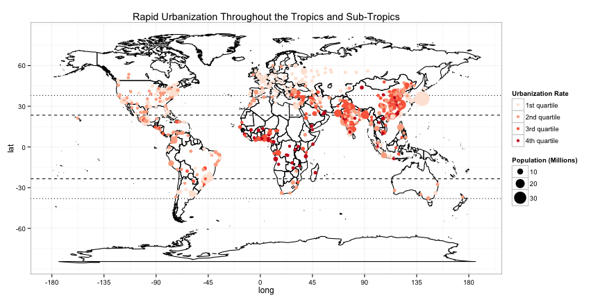
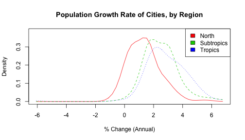
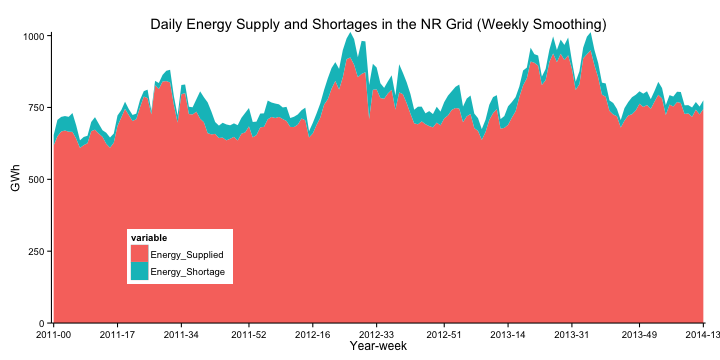
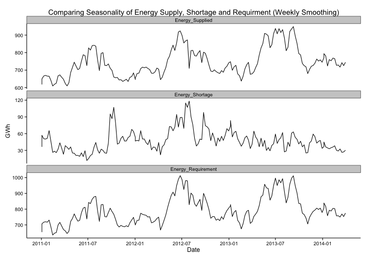
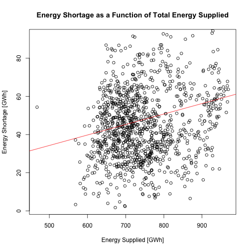

Peak Load Management for Rapidly Developing Cities
========================================================
The Challenge of Energy Service Provision Parity in Developed and Developing World Cities: Observations from Northern India
--------------------------------------------------------

By Elliot Cohen and Vijay Modi   
Sustainable Engineering Lab   
Earth Institute of Columbia University   
*************


#### Motivation
Many of the world's **largest** and **fastest-growing** cities--from Karachi (pop. 14 million; 34.6% increase from 2000-2010) to Delhi (22m; 39.4%), Dhaka (15m, 45.2%), Jakarta (10m; 14.8%), Bangkok (8m, 29.1%), Lagos (11m; 48.2%) and Kinshasa (9m, 55.4%)--are located in South Asia and Sub-Saharan Africa with tropical to sub-tropical climates unlike those of most cities in the global North. As a result, it is important to consider how energy demand--particularly for thermal comfort--will evolve differently in these places. Figure 1 provides a map of urbanization rates for cities worldwide with a population greater than 750,000 (UN 2011). Urbanization rates are clearly highest in South Asia and Sub-Saharan Africa. Figure 2 shows the *distribution* of population growth rates for the same set of cities, grouped by latitude (global North, Tropics and Subtropics). The expected value (e.g. central tendancy) of urbanization rates in these regions are clearly distinct.


 

```
## [1] "World's Largest Cities in 2015 (Population > 10 million)"
```

```
##        Continent            Country              Urban.Agglomeration Population [MM]
## 1           Asia              Japan                            Tokyo            38.2
## 2           Asia              India                            Delhi            25.6
## 3           Asia              China                         Shanghai            23.0
## 4  North.America             Mexico   Ciudad de México (Mexico City)            21.7
## 5  North.America              U.S.A                  New York-Newark            21.3
## 6           Asia              India                  Mumbai (Bombay)            21.2
## 7  South.America             Brazil                        São Paulo            21.0
## 8           Asia              China                          Beijing            18.1
## 9           Asia         Bangladesh                            Dhaka            17.4
## 10          Asia           Pakistan                          Karachi            15.5
## 11          Asia              India               Kolkata (Calcutta)            15.1
## 12 South.America          Argentina                     Buenos Aires            14.2
## 13 North.America              U.S.A Los Angeles-Long Beach-Santa Ana            14.1
## 14        Africa            Nigeria                            Lagos            13.1
## 15          Asia        Philippines                           Manila            12.9
## 16          Asia             Turkey                         Istanbul            12.5
## 17        Europe             Turkey                         Istanbul            12.5
## 18          Asia              China             Guangzhou, Guangdong            12.4
## 19 South.America             Brazil                   Rio de Janeiro            12.4
## 20          Asia              China                         Shenzhen            12.3
## 21          Asia Russian Federation                  Moskva (Moscow)            12.1
## 22        Europe Russian Federation                  Moskva (Moscow)            12.1
## 23        Africa              Egypt               Al-Qahirah (Cairo)            11.9
## 24          Asia              Japan                       Osaka-Kobe            11.8
## 25        Europe             France                            Paris            11.1
## 26          Asia              China                        Chongqing            11.1
## 27          Asia          Indonesia                          Jakarta            10.5
## 28        Africa              D.R.C                         Kinshasa            10.3
## 29          Asia              China                            Wuhan            10.3
## 30 North.America              U.S.A                          Chicago            10.2
## 31          Asia              India                        Bangalore            10.0
```

```
## [1] "World's Fastest Growing Cities (2010-2015) with a Population > 750,000"
```

```
##    Continent       Country  Urban.Agglomeration Growth.Rate [%]
## 1       Asia      Thailand         Samut Prakan            9.15
## 2       Asia      Viet Nam              Can Tho            8.78
## 3     Africa       Somalia Muqdisho (Mogadishu)            8.01
## 4     Africa Côte d'Ivoire         Yamoussoukro            7.52
## 5       Asia         U.A.E Abu Zaby (Abu Dhabi)            7.22
## 6     Africa  Burkina Faso          Ouagadougou            6.88
## 7       Asia     Indonesia                Batam            6.78
## 8       Asia         U.A.E       Dubayy (Dubai)            6.75
## 9       Asia         U.A.E              Sharjah            6.51
## 10      Asia         China               Xiamen            5.93
## 11      Asia         China      Suzhou, Jiangsu            5.92
## 12    Africa         Niger               Niamey            5.86
## 13      Asia         China          Wuhu, Anhui            5.81
## 14      Asia         China                Hefei            5.78
## 15      Asia         China             Yinchuan            5.77
## 16      Asia     Indonesia             Denpasar            5.74
## 17    Africa       Nigeria                Abuja            5.74
## 18      Asia         China             Jinjiang            5.63
## 19      Asia         China            Zhongshan            5.58
## 20      Asia         India             Tiruppur            5.34
```


 

To illustrate the potential for vast differences in energy demand for thermal comfort between cities in the global North and cities in the tropics/sub-tropics, consider Delhi, India.  Delhi--with its massive population and very hot climate--is an outlier compared to cities in the global North but typical of South Asia: Peak summer temperatures routinely exceed 40 deg C. (104 F.), and intense heatwaves can approach 50 deg C. (122 F.). Given the huge temperature differential between outdoor (say 104 F.) and desired indoor air temperature (say 72 F), and the thermodynamic fact that energy for cooling scales linearly with that differential, cooling a room in Delhi will require twice as much energy as cooling a room in New York where the temperature differential is half that. As further evidence, in the past year, Delhi had over **six** times as many cooling-degree days as New York City, assuming an indoor air temperature of 72 deg F. Compounded by leaky building envelopes in developing world cities (designed for natural ventilation, not air conditiong), intense heat-island effects (typically less green space), and massive population growth, peak electricity demand in cities thourought the developing world could one day surpass that of their neighbors to the north--not only in aggregate terms because of their size, but also *per-capita* due to thermodynamics. That is, if we consider attaining energy parity between developed and developing world cities in terms of *service provision* rather than BTU or KWh, then we begin to understand the true magnitude of future energy demand, and associated resource consumption and environmental impact.

This has important implications not only for local/regional grid planning and reliability, but also the global transition to renewable energy given the limitations of meeting such large and 'peaky' demand with non-dispatchable resources such as wind and solar.


******
#### Rationale
Mid- to long-range energy demand forecasts are typically reported as annual totals and provide little insight to the distribution throughout the year. To address this shortcoming, we focus on the diurnal and seasonal distribution of energy demand and supply, which drive system cost but recieve relatively little attention in energy outlooks. This requires more and better data than is typically available to researchers. 

This study presents an empirical analysis of diurnal-to-seasonal energy use patterns for 9 states in Northern India with a combined population of nearly 1/2 billion where we have data and prior experience.  This analyses described here can serve as a methodological template for future analysis in other parts of the developing world, particularly in South Asia and Sub-Saharan Africa.

#### Methods and Materials
Each state is responsible for injection-load balance within its state periphery (e.g. power control area, or PCA) and coordination with the parent (regional) grid operator. Regional grid operators, in turn, are responsible for load balance within their region and coordination with the overarching national grid. This hierarchical structure offers a "natural experiment" for testing the effect of explanatory variables of interest such as climate, urbanization and income, while controlling for confounding factors such as power sector regulatory structure, pricing mechanisms, technology adoption, and technical expertise, which can be assumed to be similar for all States operating in the same regional grid.

The Northern Region Load Dispatch Center (NRLDC) is charged with injection/load balance for the entire Northern Region (NR) of India, including coordination of 9 constituent State Load Dispatch Centers (SLDCs) located in the region, and the National Load Dispatch Center (NLDC), which handles inter-regional energy exchanges to maintain overall grid frequency and stability. The NR is the largest of 5 regional power grids, supplying 273,240 GWh in 2012/13 and meeting a peak demand of 41,790 MW.

The NRLDC maintains power system data for each of the 9 constituent states and the region as a whole. The data is publically available on their website, but only for downlaod as PDF. Batch downloading and converting PDF to readable format (e.g. csv) is messy, cumbersome and prone to errors. To side-step this limitation, and to better utilize available data, a JavaScript was developed to "scrape" HTML from inside the NRLDC web browser. Post-processing and subsequent data analysis was performed in RStudio using markdown language.

Data analyzed for this study was derived from a daily report published by the NRLDC entitled "Power Supply Position in the Northern Region". The pertinent data can be summarized as follows:
* Regional Availability and Demand: Evening-Peak (MW), Off-Peak (MW), Day-Energy (GWh)  
* State Control Area Details: Generation (GWh), Drawal (GWh), Use (GWh)  
* State Demand Met: Evening-Peak (MW), Off-Peak (MW), Day-Energy (GWh)
* Stationwise Details: Installed/Declared Capacity (MW), Peak/Off-Peak/Average Sentout (MW), Schedule/Unscheduled Interchange (GWh)  
   
   
#### Regional Energy Availability and Demand
First, we explore the daily demand profile of the Northern Region (NR). For clarity, we apply weekly smoothing to the daily data.
 

**Figure 1. Time series of energy supply and shortages in the NR grid (2011-14)**  

 

**Figure 2. Comparing seasonality of energy supply, energy shortages and energy requirement for Northern India**  

An important first question is when do shortages arise?  From Figure 1 we may glean that they are not strictly seasonal nor confined to peak summer months when demand is highest. To confirm, we boxplot energy shortages by month and examine their relative distributions. We see that median energy shortage is highest in October and July, with July having the highest variability of any month. Median energy shortage is lowest in the winter months.  


**Figure 3. Monthly boxplots of daily energy shortages in Northern India**  

If the magnitude of energy shortfalls (e.g. energy not supplied; ENS) is not strictly seasonal, perhaps peak shortages as a fraction of peak demand, is. In other words, do certain months experience higher rates of load-shedding at peak times?   


**Figure 4. Seasonality of peak shedding as fraction of peak demand**  
Similar to Figure 2, we see the greatest variance in July, but here the median is fairly stable, with peak shedding 5-10% of peak demand in all months.   

As another check, we examine energy shortages as a function of total energy supplied.  This helps answer the question: Do shortages increase as demand increases?  We would expect this to be true if capacity adequacy was the limiting factor.   


**Figure 5. Scatterplot of Energy Shortage vs. Energy Supplied**   


**Figure 6. Daily energy shortages [in GWh] for the NR grid, with weekly and monthly smoothing**  

 

**Figure 7. Daily energy supply [in GWh] for the NR grid, with weekly and monthly smoothing**  

 

**Figure 8. Fraction _Energy Not Supplied_ to the NR grid, with weekly and monthly smoothing**  

 

**Figure 9. Comparing Daily Peak vs Off-Peak Demand for the NR grid with weekly and monthly smoothing**  

